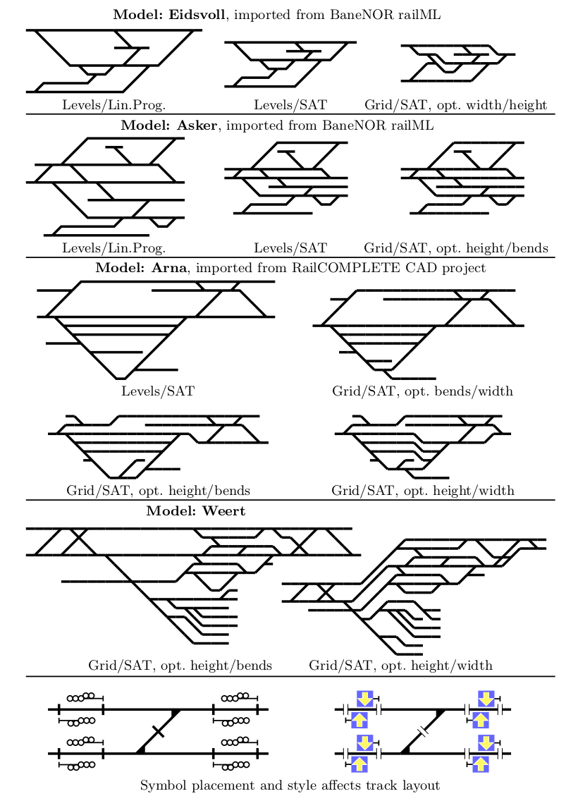

**railplot** -- create drawings of railway infrastructure.

### Features:

* Import railML 2.x, or use the railplot custom format
* Choose from three drawing methods: 
  - Levels-based linear programming (very fast but switches are straight),
  - Levels-based SAT (fast but does not bend edges), or
  - Grid-based SAT (less fast, but can create optimal width/height).
* Choose optimization criteria: width, height, bends, etc.
* Save output as:
  - JSON (for use in other applications), 
  - SVG (image format), or 
  - TikZ (LateX document format).

### Examples:

