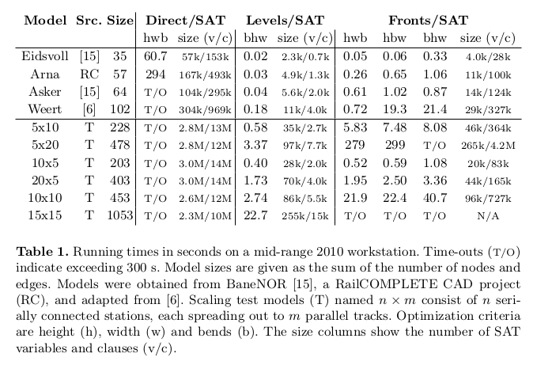
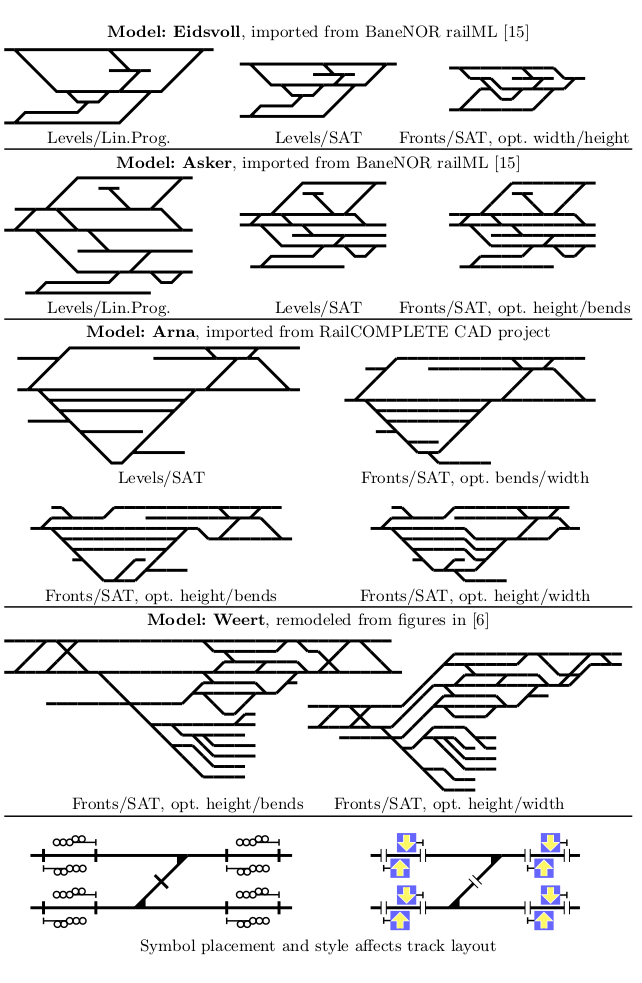

# Alternative implementations

This directory contains experiments in different
ways of encoding and solving the schematic plan problem.

1. `01_gridsat`: Direct SAT grid encoding (Haskell program using [satplus](https://github.com/koengit/satplus/))
2. `02_lp`: Linear programming encoding (Haskell program using the cbc solver (`cabal install limp-cbc`)) 
3. `03_levelssat`: Level-based SAT encoding (Rust program)
4. `04_frontssat`: Fronts-based SAT encoding (Haskell program using [satplus](https://github.com/koengit/satplus/))

